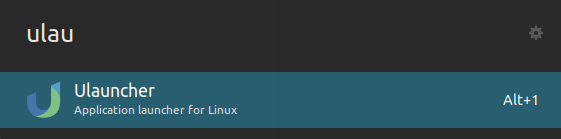

# Yaru-dark ulauncher theme

Ulauncher theme made with the new colors of Ubuntu 20.04+

If you don't have Ulauncher installed, download it from [here](https://ulauncher.io/#Download)

## Result



## Installation

Click on "code" button, download the zip file and extract it in **~/.config/ulauncher/user-themes/**

Or open the terminal and run these commands:

```sh
mkdir -p ~/.config/ulauncher/user-themes
git clone https://github.com/abish7643/Yaru-dark-ulauncher.git ~/.config/ulauncher/user-themes/Yaru-dark-ulauncher
cd ~/.config/ulauncher/user-themes/Yaru-dark-ulauncher
<<<<<<< HEAD
git checkout yaru-orange
=======
git checkout yaru-teal
>>>>>>> 95f9f2e04cb79e4187fb0f8a9ca6ed458b019da6
```
